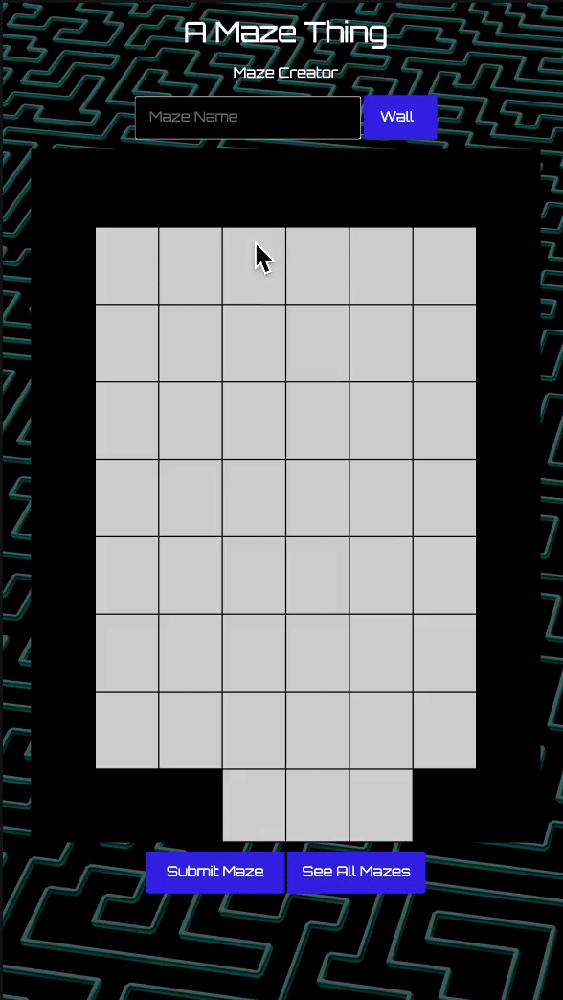

# A Maze Thing Backend

A Maze Thing Backend is the CRUD webapp component of the A Maze Thing native application. Within this application, users can create a new maze, post that maze to a Postgres database, and can view all user-created mazes.

<h3>Sample</h3>
<center></center>

## Getting Started

<h3>Basic setup</h3>
Fork the project then clone it:

```
git clone https://github.com/yourgithubname/maze-backend.git
```

Install modules:

```
npm install
```

Create database in terminal:
```
createdb amazething
```

Start Express Server

```
npm start
```

Visit the website at:

```
https://localhost:8080
```

<h3>Seeding</h3>
You can seed the file by running <code>npm run seed</code>

## Deployment

This app is deployed on heroku at the following link: https://a-maze-thing.herokuapp.com/

## Built With

-  [Express](https://www.npmjs.com/package/express) - Used to build our backend server
-  [PostgreSQL](https://www.postgresql.org/) - Used to build our database
-  [Axios](https://www.npmjs.com/package/axios) - Used to make convienent AJAX requests to our server

## Authors

<ul>
   <li><b>Alex Yi</b> <p>Worked on backend routes and created all mazes page</p></li>
   <li><b>Ani Kerr</b> <p>Worked on styling</p></li>
   <li><b>Edward Lee</b> <p>Worked on backend routes and all mazes page</p></li>
   <li><b>Kevin Lin</b> <p>Worked on index page and painting functionality</p></li>
</ul>

## License

This project is licensed under the MIT License

## Acknowledgments

-  <b>Ben Rodriguez @b17z</b>
-  <b>John McDonald @johnptmcdonald</b>
-  <b>Eric Folks @efolks</b>
